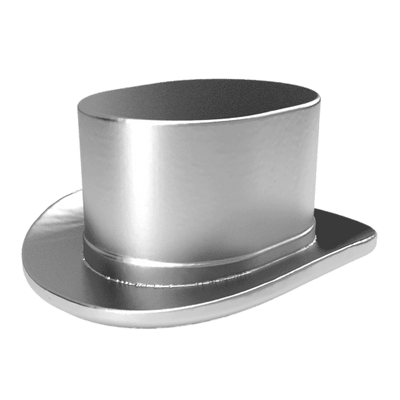

# Monopoly Game Project for COP3252
## By: Trever Alspach, Kaitlin Tran, and Benjamin Zech

### Game instructions

- Requires 2-4 players
- Each player starts off with $1500
- Players begin at the “Go” space and move clockwise around the board (contains 40 spaces)
- Wild cards
  - If a player lands on a chance or community chest space, they must draw a chance/community card from the deck and follow directions.
- Jail
  - Players in jail cannot play until they pay $50 bail.
- Owning property
  - If a player lands on an unowned property, they have the choice to buy it using money.
  - If a player lands on an owned property, they owe the owner of the property rent money.
- Monopoly
  - If a player owns every property of a single color, they have a monopoly. Rent is doubled.
  - Players that own monopolies can build houses and hotels on properties to increase rent.
- If you run out of money, you’re out. Winner is the last player standing

### Interface

- In the start window, choose the number of players (2-4) by clicking on the corresponding button.

- The main window opens up with the requested number of players.
  - Player 1 is represented by the car icon.
  - 
  - Player 2 is represented by the hat icon.
  - 
  - Player 3 is represented by the ship icon.
  - 
  - Player 4 is represented by the dog icon.
  - 

- Starting with Player 1, roll 2 dice to move spaces by using the “Roll Dice” button. The sum of the dice roll will be how many spaces a player moves, which will be performed automatically
  - If you roll doubles, you can roll again.
  - If you roll doubles 3 times, you go to jail.
  - When a player has used up all of their available dice rolls for their turn, the "Roll Dice" button no longer works.
- If you land on an unowned space, you will be prompted with the question to buy the property.
  - Select “yes” means you pay the price (displayed on the board) and own the property.
    - You can view your properties in a separate tab with the “View Properties” button.
      - You can buy houses and hotels in this tab once you own a monopoly of properties.
- If you land on an owned space, you automatically pay rent to the owner.
- If you are in jail when your turn begins, you will automatically pay the $50 bail.
- If you land on a chance or community chest space, the effects of the card (moving spacing, losing/gaining money) will automatically take place.
- If you are done with your turn, click the “Next Turn” button.
- A listView at the bottom of the main window 

### Implementation

○ Any other important details about your implementation, how to run the program, etc

### Extra Features

○ Descriptions of any extra features implemented

### Credits

#### Trevor Alspach

○ A description of the separation of work between partners (who was responsible for what
pieces of the program)

#### Kaitlin Tran

- Created Dice.java model
- Uploaded images of Monopoly board, community chest cards, chance cards, and dice sides for use in GUI
- Implemented graphics when "Roll Dice" button is clicked so that images of correct dice side appear on the board when dice are virtually "rolled".
- Placed house and hotel graphics onto designated board positions to appear when a player buys houses on certain properties
- Created property card graphics for display in properties window
- Documented project details in README.md file

#### Benjamin Zech

○ A description of the separation of work between partners (who was responsible for what
pieces of the program)

[Monopoly Board Reference](https://www.amazon.com/Hasbro-00009-482-Monopoly-Board/dp/B00CV5PN2W)

[Board Reference Image](SampleMonopolyBoard.jpg)

[Chance and Community Chest Cards References](https://www.monopolyland.com/list-monopoly-chance-community-chest-cards/)

[Monopoly Template for Photoshop](https://bradfrost.com/blog/post/monopoly-photoshop-template/)
